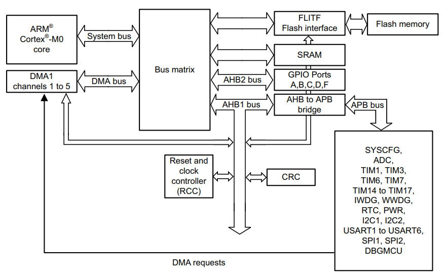
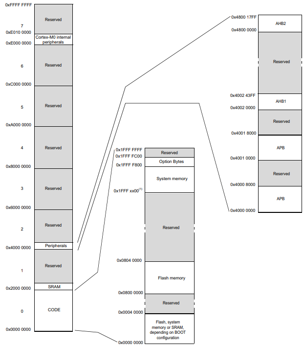

# Understanding our microcontroller

This page dives into the reference manual of STM32F030K6 and explains all the important information within the [reference manual](https://www.st.com/resource/en/reference_manual/dm00091010-stm32f030x4x6x8xc-and-stm32f070x6xb-advanced-armbased-32bit-mcus-stmicroelectronics.pdf).

## System architecture

In the figure below we can observe the system architecture. 



As shown in the figure, the CPU access all the peripherals like ADC and SPI for example, via the APB bus which is connected to AHB1 bus. These busses are the clock connections between CPU and peripherals. So in order to read an ADC value, for example, first you need to activate the clock of ADC peripherals. If you don't activate, the CPU can't read the sampled values. You also need to configure the periphals register.


## Memory mapping

In the figure below we can observe the memory mapping. 



## Code section

The code section in memory starts at address ```` 0x0000 0000 ```` and ends at address ```` 0x2000 0000 ````. This sections includes memory address of Flash memory, system memory and bootconfiguration.

- From address ```` 0x0000 0000 ```` to ```` 0x0004 0000 ```` we have flash, system memory or SRAM.
- From address ```` 0x0800 0000 ```` to ```` 0x0804 0000 ```` we have the flash memory section

## SRAM section

- From address ```` 0x2000 0000 ```` to ```` 0x4000 0000 ```` we have the SRAM section

## Peripherals section

- From address ```` 0x4000 0000 ```` to ```` 0x4000 8000 ```` we have the memory section of APB registers. All the peripherals (ADCs, timers etc.) which are connected to APB registers can be configured simply by writing values inside these memory block. Information about the registers can be found into the [APB Registers section](#apb-registers).


# APB Registers

dslçkdçsld
